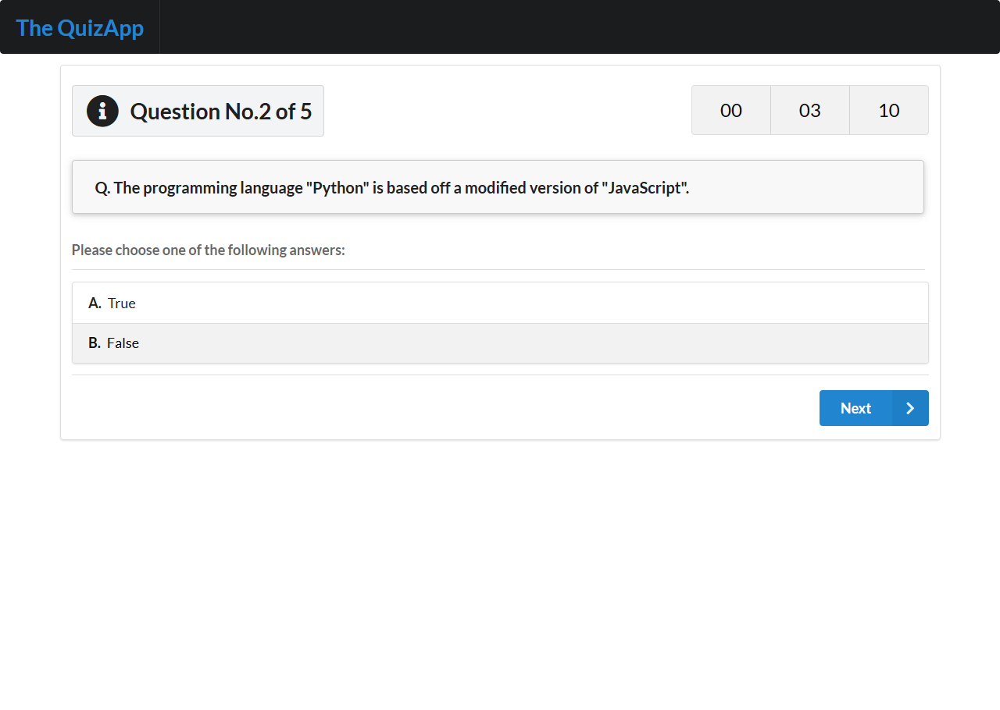

# Quiz App

Quiz App Built with React Using OpenTDB API

<p>
  
</p>

## Development

Install dependencies:

```
npm install
```

### npm scripts

- `npm start` - start development server
- `npm run build` - build into the `build/` directory
- `npm test` - Start the test runner
- `npm run eject` - If you aren’t satisfied with the build tool and configuration choices, you can `eject` at any time. This command will remove the single build dependency from your project.

## License

This Quiz App is an open source software [licensed as MIT](https://github.com/safdarjamal/quiz-app/blob/master/LICENSE).
